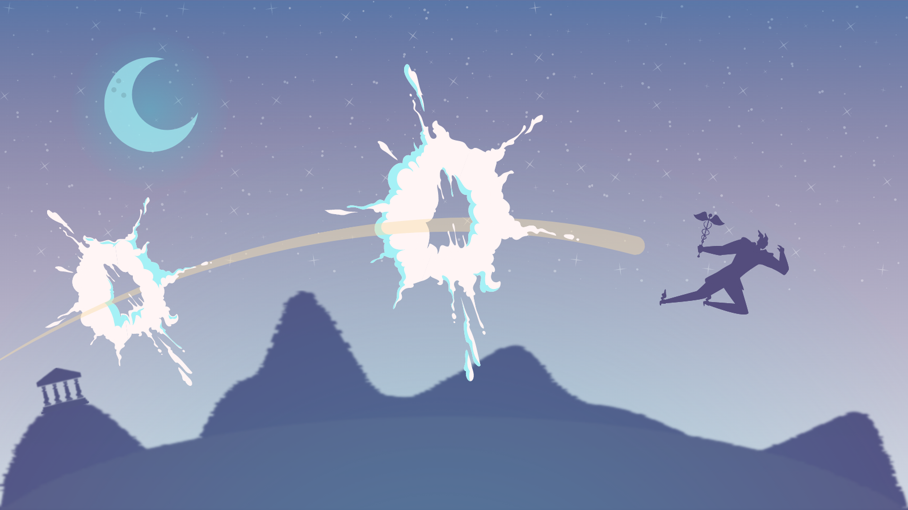

# What is Hermes Defi?

## Origin

Born in July 2021 under the head of v_alleyrider and his little brother_.

Created under the principles. **Safe**, **Transparent** & **Fast**

* _Safe_

The contracts used by Hermes have the maximum existing mechanisms to ensure the security of the funds housed in them.&#x20;

* _Transparent_

Throughout the time users are aware of the location and status of their capital, all movements made by Hermes are public and communicated.

* _Fast_

The entire team has a dynamic mentality and a maximum disposition to go, ready to face new challenges that arise, in a fast way, always without compromising the security of the project.

## Values

* Bring Defi closer to a global and diverse world.&#x20;
* Make known the possibilities of your capital&#x20;
* Promote education within it, making it accessible and understandable.&#x20;
* Collaborate to achieve a fair environment through Hermes Foundation.

## What does Hermes represent?

Hermes is a God of the Greek Olympus, who represents

* Physical and knowledge travelers
* Innovations&#x20;
* Commerce

These 3 representations coincide with Defi's intrinsic values, so Hermes is the perfect figure to lead our project.

## **Mission**

The mission is clear and simple.

* Provide all Defi services available on a single platform
* Generate new products to solve new problems

## Vision

Defi will be one of the sectors that will be at the forefront of the world economy in the coming years.

Being part of this sector from now on, developing and understanding the mechanisms that manage it and which are the ones that will do it in the future, being ourselves the precursors of them. This allows Hermes to position itself as one of the visible heads of the sector today and as a key player in the future.

