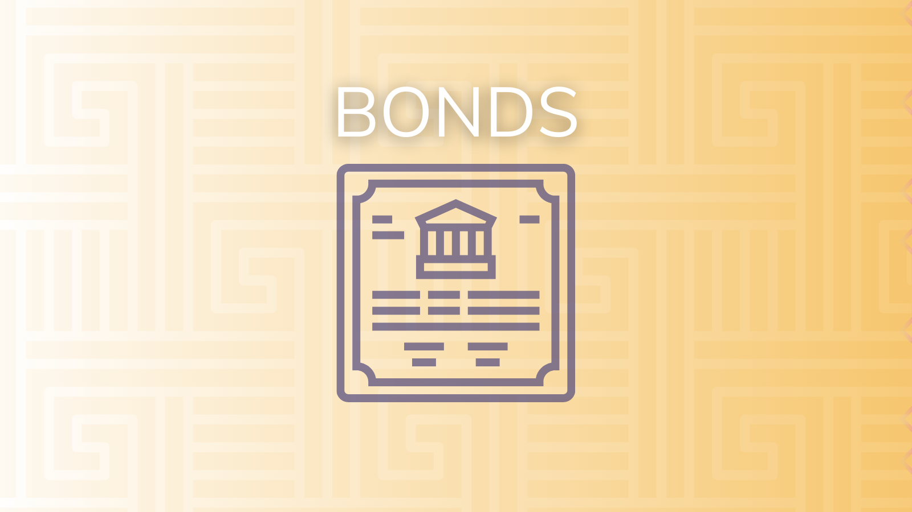

# Hermes Bonds

## What is a bond?


Bonding allows Hermes Protocol to accumulate its own liquidity and start building its investment treasury.


Bonding is the main value accrual strategy of The Hermes Protocol. It allows the Protocol to acquire its own liquidity and other reserve assets such as WONE and USDC **by selling HRMS at a discount** over a set period of time **(a bond)** in exchange for these assets.

To the end user, the Protocol quotes the bonder with terms such as:

* The **bond price** (Asset bonded per unit of HRMS)
* The amount of **HRMS tokens** entitled to the bonder.&#x20;
* The **vesting term** (How long until the bond matures). Note: the bonder can claim HRMS rewards over the bond duration.

The types of bonds available and their duration will be **actively developed** by Hermes Defi's **AlgoFi team** with established limits to bonding duration and tokens available for purchase through bonding **set via formal governance**. These metrics were designed to maximize sustainable growth during HRMS emissions.&#x20;


Bonding is an active, short-term strategy.


The price discovery mechanism of the secondary bond market renders bond discounts more or less unpredictable. Therefore bonding is considered a more active investment strategy that has to be monitored constantly in order to be more profitable as compared to staking. Because the bond quote occurs when the user executes the transaction, the ROI may increase or decrease with the price of HRMS.

### What bonds are offered?

The initial list of assets that Hermes will offer bonds for are as follows:

* WONE
* USDC
* HRMS / WONE
* HRMS / USDC
* IRIS -- Available on launch, but may be removed after some time.

<table><thead><tr><th>Asset</th><th>Type</th><th>Vesting Period</th><th>Discount (%)</th><th data-type="number">HRMS Allocation</th></tr></thead><tbody><tr><td>WONE</td><td>Single</td><td>30d</td><td>8</td><td>16000</td></tr><tr><td>USDC</td><td>Single</td><td>30d</td><td>8</td><td>16000</td></tr><tr><td>IRIS</td><td>Single</td><td>30d</td><td>8</td><td>12000</td></tr><tr><td>HRMS/WONE</td><td>LP</td><td>15d</td><td>3</td><td>6400</td></tr><tr><td>HRMS/WONE</td><td>LP</td><td>30d</td><td>8</td><td>9600</td></tr><tr><td>HRMS/USDC</td><td>LP</td><td>15d</td><td>3</td><td>8000</td></tr><tr><td>HRMS/USDC</td><td>LP</td><td>30d</td><td>8</td><td>12000</td></tr><tr><td>Total HRMS</td><td></td><td></td><td></td><td>80000</td></tr></tbody></table>


With various bonding assets, durations, and discounts, users will be able to acquire HRMS based on these variables and their personal preferences.


### Protocol Strategy

The Protocol has prepared a strategy that allows it to start accumulating **two types of assets**.

* Native liquidity (HRMS/WONE, HRMS/USDC)
* Tokens with a large market backing aka "Blue Chips" (WONE, USDC)

By obtaining these types of assets we will be able to achieve two essential goals for any Protocol:&#x20;

* Obtain the platform with the highest possible liquidity (such that swaps are most cost effective on this platform, further rewarding investors through [IRIS](../tokenomics/feenomics.md#swap-fee), [xHRMS](xhrms.md), and [sHRMS](shrms.md)).
* Create strategies where the Protocol's treasury is fed and this profit is returned to the investors.


Obtaining native LPs will allow the Protocol to reinvest them in the platform itself and generate a more stable liquidity base for users. Paired with our commitment to platform security, this will help to attract large capital to the platform.


Obtaining "blue chips" will allow the Treasury to create **complex investment strategies**. The Treasury (through IRIS governance) would approve an investment portfolio allocation into low, medium, and high-risk categories.

The Hermes AlgoFi team will help to identify investment opportunities, calculate the risk associated with these investments, and determine profit taking strategies. This will allow the Protocol to invest into other projects (of varying risk levels), execute an investment strategy, and return those profits (through existing and potentially new defi primitives) to Protocol investors.

#### A note on The Curve Wars

You may have heard of the [Curve wars](https://defieducation.substack.com/p/the-great-curve-wars?s=r) before. Curve Finance is a defi utility platform (defi primitive) that focuses on cost-effective stable asset swaps (USDC, UST, FRAX). The farming reward emissions (paid in the CRV governance token) are directly controlled through vote-locked CRV (veCRV). Thus, anyone with enough veCRV can vote for and reward liquidity providers of their choice. This has led to multiple DAO’s (Convex, Yearn, Frax, Hidden Hand, Olympus DAO) aggressively acquiring CRV to direct liquidity rewards back to their platform.

This idea helped to inspire the Protocol's strategy, but with a much greater dynamic range. Our first goal is to grow and support our own protocol’s liquidity through bonding, but later, we plan to expand our investment capabilities and diversification to build a flywheel effect -- grow Protocol liquidity, reward investors in the Protocol, increase liquidity through bonding / farming, and repeat.&#x20;

So while CRV focuses on delivering the utility of stable asset swaps, we are growing this idea to encompass liquidity acquisition and enable the most cost-effective swaps **across any available asset**. Through Harmony's extensive (and growing) bridge system and extremely low transaction fees, The Hermes Protocol is poised to do something special.&#x20;

One of the main disadvantages with open-source policies is that Protocols have to openly state their buying intentions and price points. By allocation of this task to a dedicated group of financial experts (within the limits set via governance), we are able to execute strategies that may not be possible through completely DAO-controlled protocols. To compensate for this transparency barrier, we will be providing continuous performance metrics in an analytics dashboard and weekly Protocol summaries as well as abiding by limits set via governance.

### The Hermes Bonding Innovation

As indicated in the [tokenomics](broken-reference), 8% of the total supply or 2,400,000 HRMS is currently dedicated towards bonding.


Across 2.5 years, 80,000 HRMS can be distributed each month.


Depending on popularity, platform growth, and other variables, this allocation can be **readjusted**. Analysis of bonding efficiency, compared to other emissions of the HRMS token, will be performed in order to obtain the best result for The Hermes Protocol.

#### Unique Advantages of Bonding on The Hermes Protocol

The bond offered by The Hermes Protocol has certain characteristics that make it unique from the usual bond systems. First, the bonds will be offered for **limited time ranges**. This allows Hermes to adjust its emission strategies on a monthly basis and prevent hyper-inflation often associated with other bonding projects.

Typical bonding systems offer bonds for an unlimited time**,** leading to a massive increase of token supply and massive inflation (Euphoria, Olympus). In contrast, the Protocol is committed to monthly discount rounds so users to obtain HRMS progressively. This steady acquisition of protocol owned funds will then allow Hermes to achieve the above mentioned goals.

Additionally, our bond offers are **limited in number of tokens**, so it is possible that some time after bonds are released, users may not be able to acquire tokens and must wait for the next cycle. The only other ways to obtain HRMS are through providing liquidity and farming.

### Hermes Bonding Cycles

Hermes bonds will be launched in 30 day cycles to ensure the control of the token issuance and at the same time optimize to find the most appropriate configuration. Bonding cycles allow adjustment to best fit both the users and their preferences in the previous cycle and the Protocol's treasury and its strategies.&#x20;


The cycle will be based on 4 simple phases: Configure, Implement, Review, and Launch.


1. **Configure** the strategy of the cycle. (Asset, Discount)
2. **Implement** the previous cycle strategy (Duration, Allocation)
3. 4-day **review** by the team of the new strategy
   1. Utilization of previous cycle (% sold) and time it took to complete (time to 100%)
   2. Adjust discounts to compete with farms
   3. Other factors
4. **Launch** new bond strategy

### Hermes Bonding by the Numbers

To help protect Protocol strategy, the calculations to obtain these metrics will be kept private. However, private does not mean that users should be discouraged from discussing bonding in our community to integrate user feedback.&#x20;

Additionally, there will be a bonding dashboard within our analytics page to help everyone track bonding, treasury performance, positions, and statistics. This will help make users make informed decision about bonding their tokens to grow the Protocol's treasury.


According to **current estimates** Hermes Defi Bonding can achieve:

A value in excess of **$15,000 per week** ($60,000 per month) in its treasury during cycle 0.&#x20;


This calculation assumes:

* Total TVL of the platform: $32,000,000
* Average HRMS price over the cycle: $0.78 -- This is our most conservative estimate within our bonding model and peer analysis.
