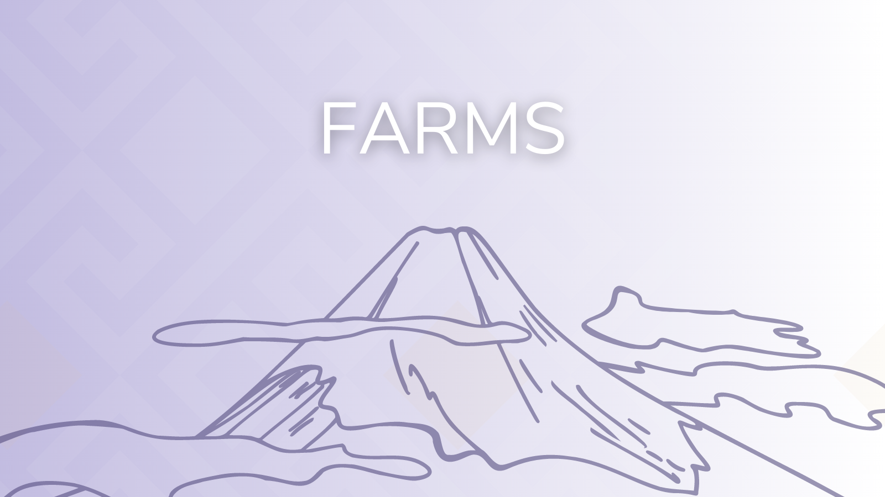

# Hermes Farms

## What is Liquidity Farming?

### Liquidity Positions

[Liquidity farming](https://wiki.hermesdefi.io/index.php?title=Introduction\_To\_DeFi#Yield\_Farming) is a type of yield-generation strategy that rewards users who _provide liquidity_ to a decentralized exchange. To enter into a yield farm, users must first create a [liquidity position](https://wiki.hermesdefi.io/index.php?title=How\_To\_Create\_an\_LP\_Pair). Briefly, the user must supply equivalent values of two tokens to create a Liquidity Position, which is represented as a 'HERMES-LP' token and returned to the user's wallet.&#x20;


At Hermes, 85% of swap fees are returned to LP providers. Earnings from swap fees are automatically compounded without user input, and are realized when one 'Breaks' their liquidity position back into the two underlying tokens.


Whenever you enter a liquidity position, you should be aware of [Impermanent loss](https://wiki.hermesdefi.io/index.php?title=Introduction\_To\_DeFi#Impermanent\_Loss), which occurs when there is drastic divergence in token prices within the liquidity position. Impermanent loss is complex idea, but often the rewards from farming often still offset this effect. Additionally, liquidity positions with Stablecoins (UST, 1USDC) or highly correlated assets (hONE/WONE) can reduce this risk.

### Farming Liquidity Positions

Decentralized exchanges thrive on liquidity and volume. To help encourage users to contribute to liquidity, DEX's offer additional rewards on top of swap fees. At Hermes, we have designed a  [farming-emissions-schedule.md](../tokenomics/farming-emissions-schedule.md "mention") that is set to sustainably grow our liquidity over the next 2.5 years.&#x20;

Typically, the tokens earned by Farming a liquidity position are hyper-inflationary and often serve no additional purposes. This is not the case with our token, HRMS, which has an established (and growing) [list of utilities.](../tokenomics/tokens-iris-plts-and-hrms.md#usdhrms-utility-and-ecosystem) Briefly, this includes earning a share of trading fee revenue, utilization as collateral in our upcoming lending/borrowing market, and earning partner reward tokens among other things. We will not target unsustainable yields that place undue sell pressure on our token.&#x20;

To get started earning HRMS, a user must deposit their LP token into the corresponding 'Farm' on our website. After this, they can claim rewards, increase or decrease their position, and track their portfolio through our advanced Analytics dashboard.


Rewards from Hermes farms are **FULLY UNLOCKED,** allowing users to compound earnings, realizing true APY from their investments.


### Farms Available on Launch

Hermes has spent _a lot_ of time planning our launch farms. It is absolutely critical that there is cost-efficient routing between tokens in order to support a healthy DEX. To this end, we will launch with a total of 13 farming possibilities. In an unprecedented move, we are also sharing _the exact emissions weighting_ for these farms to help our users plan out their migration and strategy for The Hermes Protocol. These values are as finalized as possible.

| Farm                  | Farm Category | Emissions Weight |
| --------------------- | ------------- | ---------------- |
| HRMS / UST            | Stablecoin    | 8%               |
| WONE / UST            | Stablecoin    | 8%               |
| UST / 1USDC           | Stablecoin    | 4%               |
| IRIS (Single Staking) | Native        | 2%               |
| IRIS / WONE           | Native        | 5%               |
| HRMS / X              | IRIS Voted    | 5%               |
| HRMS / WONE           | L1            | 30%              |
| hONE / WONE\*         | L1            | 8%               |
| HRMS / LUNA           | L1            | 6%               |
| HRMS / WMATIC         | L1            | 6%               |
| HRMS / 1ETH           | Blue Chip     | 7%               |
| WBTC / 1ETH           | Blue Chip     | 5%               |
| 1ETH / WONE           | Blue Chip     | 6%               |

\*hONE / WONE won't be available until after it is audited from Certik, estimated to be completed by the end of May.

If you scan this table, you can see that there is an IRIS-voted farm. This will be our first usage of IRIS to incentivize a specific token! If you're an IRIS holder, make sure you vote in our snapshot to determine what this farm will be.
