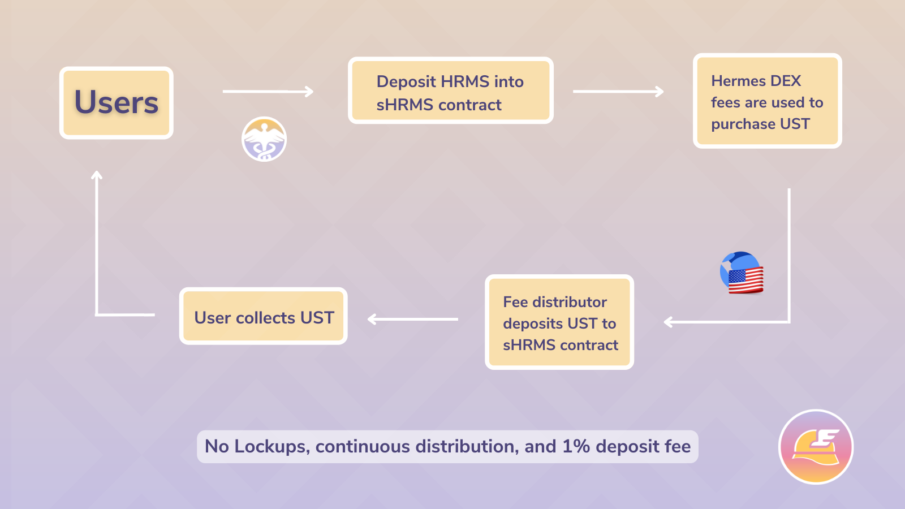

# sHRMS

## sHRMS (Salary Hermes)

sHRMS or [Salary Hermes](https://snapshot.org/#/hermesdefi.eth/proposal/0xc47f8ee25c9884e0ed5eed57da0d132c01b19a5107be942ce42b32eee3cd89de), is a single staking utility for the HRMS token that provides users with yields paid in the USDC stablecoin.

### sHRMS Mechanisms

The Hermes Fee Distribution contract receives the platform fee from each swap. With 25% of the received fee, it purchases USDC from the available liquidity and sends it to the sHRMS contract. The user earns USDC in proportion to their deposited HRMS versus the total HRMS in the sHRMS contract.

sHRMS is not a Token/Receipt therefore there is no Contract ID for sHRMS. There are no transfer capabilities, users must interact directly with the contract in order to claim USDC rewards and deposit or withdraw HRMS. However, sHRMS will be highly accessible as there are no lockup periods and HRMS can be deposit or withdrawn at any time.

### FAQ:

* _How often is_ USDC _distributed?_
  * It is constantly refilled.
* _Will there be any fees for staking/depositing?_
  * Yes, sHRMS has a deposit fee mechanism (1% fee) to prevent over-saturation.
* _Where is the fee sent?_
  * The Hermes Protocol Treasury.
* _Is there a time lock for unstaking?_
  * There won't be any timelocks for unstaking or depositing. You can withdraw your HRMS any time through the redeem option.
* _Where do these fees come from?_
  * Trade fees are 0.20% each swap. 0.17% goes to LP providers and 0.03% goes to a contract which swaps 25% of the collected fees to USDC and deposits rewards into the sHRMS contract.
* _How much do I earn?_
  * sHRMS Stakers receive rewards proportional to their share of the sHRMS vault. The amount of USDC deposited as rewards is directly related to the volume traded on the DEX. You can find in-depth information on our dedicated analytics dashboard.


User Reward Rate = userHRMS / totalHRMS \* sHRM Reward Rate.


