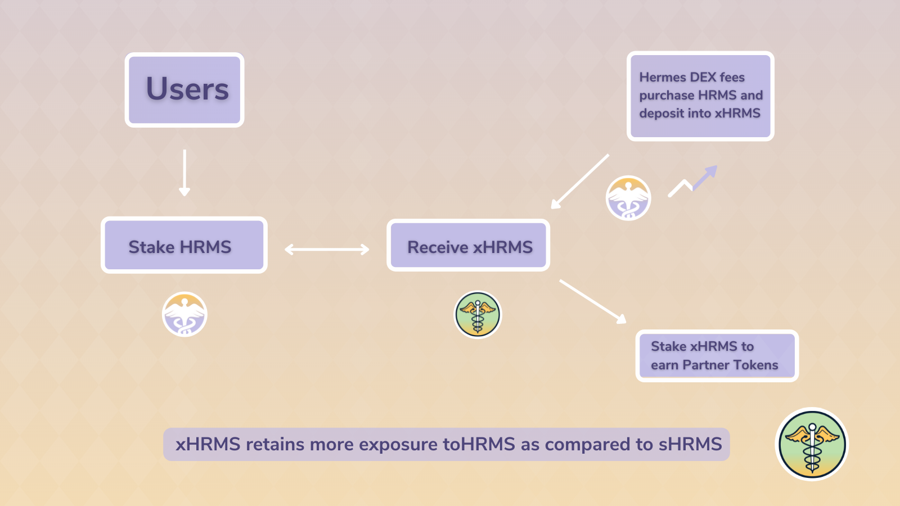

# xHRMS

## xHRMS (Xpanding Hermes)

xHRMS aka [Xpanding Hermes](https://snapshot.org/#/hermesdefi.eth/proposal/0xc798f5a9151e16e35f537f521b93173fea9064f13618fce474500001089ea187) is a single-staking usage for HRMS that will be available upon launch of The Hermes Protocol. Staking HRMS in this manner rewards you with xHRMS, which can generate yield through two mechanisms.

1. A portion of the platform [trading fees](../tokenomics/feenomics.md#swap-fee) (25%) will be used to buy HRMS and deposit into the xHRMS contract. While the original ratio of xHRMS to HRMS will start 1:1, this ratio will increase over time such that the amount of HRMS you can redeem xHRMS for increases. xHRMS retains more exposure to HRMS as compared to sHRMS.
2. xHRMS holders have the exclusive opportunity to stake xHRMS to earn partner tokens (sourced from our Dual Farms). This means that users earn both trading fees AND additional non-native reward tokens from this single asset.

### xHRMS Mechanisms

xHRMS was inspired by many other 'x' tokens (xSUSHI, xBOO, etc) that increase in redemption value and provide a sustainable way to grow exposure to an asset (HRMS) without risk of impermanent loss. In addition to this, it can be staked in pools to earn partnership tokens source from dual farms.

The Hermes Fee Distribution contract receives the platform fee from each swap. With 25% of the received fee, it purchases HRMS from the available liquidity and sends it to the xHRMS contract, increasing the number of available HRMS, such that the redemption value of each minted xHRMS increases proportional to the trading volume of our DEX.


Contract addresses will be made available one deployed on the mainnet.


### FAQ:

* _Will there be any fees for staking/depositing?_
  * No, staking and unstaking xHRMS are completely free and fully unlocked.
* _What happens when the partner staking pool is closed?_
  * When the pool is closed your xHRMS will still be undergoing buybacks, earning HRMS, but not the partner token. This allows you to move to new partner token pools when they become available while still always earning HRMS.
  * The pool will be visible on our website, so you can unstake your xHRMS.
* _Is there a time lock for unstaking?_
  * No, there will not be any timelocks for ustaking or depositing. You can withdraw the HRMS value of your xHRMS at any time through the redeem interface.
* _Where does the capital to buy HRMS come from?_
  * Trade fees are 0.20% each swap. 0.17% goes to LP providers and 0.03% goes to a contract which swaps the collected fees and sends 25% of these into HRMS and sends it to the xHRMS pool.
* _What does the APR of the xHRMS pool depend on?_
  * Because the value of xHRMS accrues over trade fees, the APR of the pool will largely depend on the trading volume for that day. To give an approximate APR, we are displaying the average over the last 7 days. You can find in-depth information on our dedicated analytics dashboard.
  * Additionally, the use of xHRMS for staking in partner pools will vary depending on the price of the partner token and the duration that the reward pool is open for.

